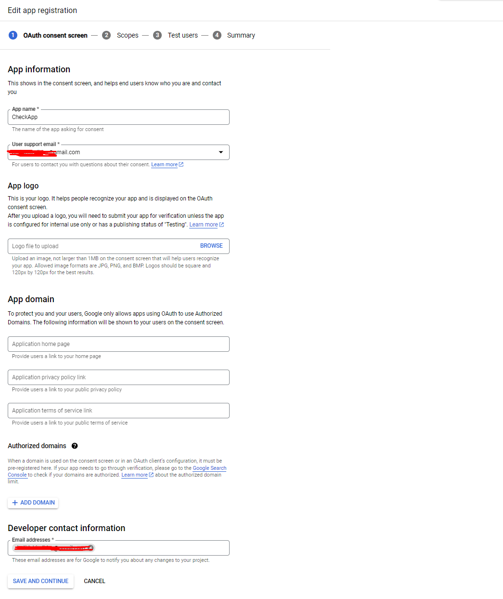
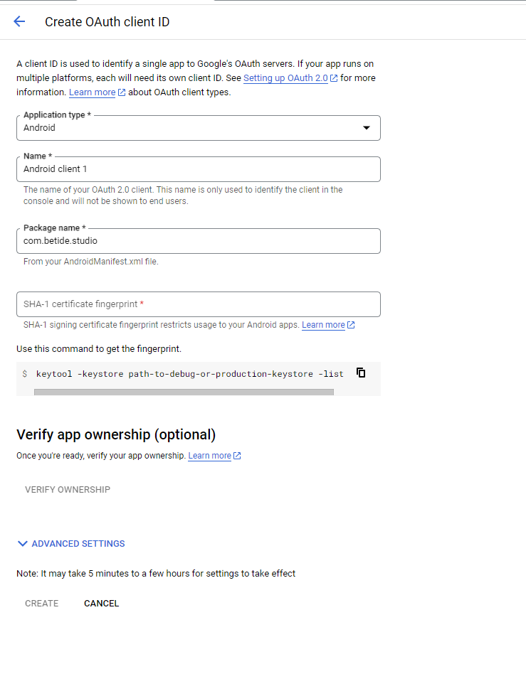
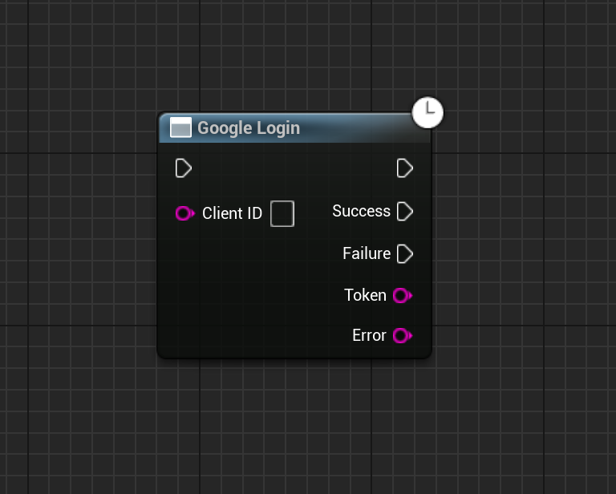
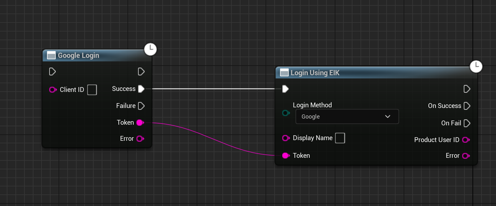
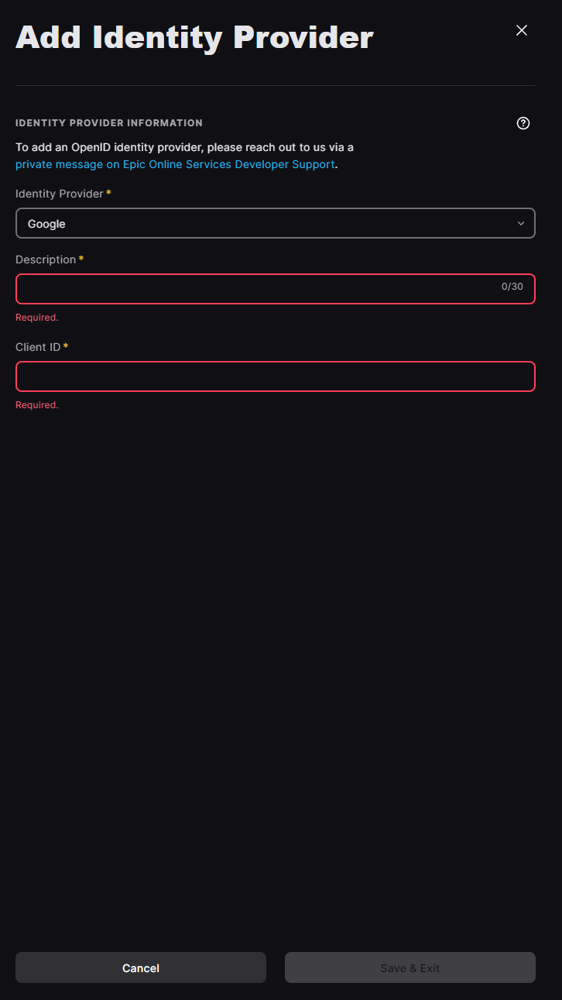

Adding google login is pretty straightforward with EIK. You can use the `GoogleSignIn` node to get the user to sign in with their Google account and get the token. You can then use this token to authenticate the user with your backend.

!!!warning Important Note
- The plugin named `GoogleOnlineSubsystem` should be disabled in the project settings. This is because EIK uses its own implementation of the Google Online Subsystem.
- The `GoogleSignIn` node should be used only once in the project. Using it multiple times can cause issues with the login process.
!!!

Here's a step-by-step guide to adding Google login to your project:
1. **Enable Google Sign-In** : To use Google Sign-In, you need to enable the Google Sign-In API for your project.

   - Go to the [Google Developers Console](https://console.developers.google.com/).
   - Create a new project or select an existing one.
   - In the left sidebar, click on `OAuth consent screen`.
   - On the `User Type` page, select `External` and click `Create`.
   - You will have to enter the `App Name` and `User Support Email` and click `Save and Continue`. (You can skip the other fields if you want to but for a better user experience and to avoid any issues, it is recommended to fill in all the fields.)
    
   - No scopes are required for this project, so click `Save and Continue`.
   - On the Next Screen, you will have option to add test users. You can skip this step by clicking `Save and Continue`.
   - Now you will have reached the last step. Click `Back to Dashboard`.
   - In the left sidebar, click on `Credentials`.
   - Click on `Create credentials` and select `OAuth client ID`.
   - Select `Android` as the application type.
   - Fill in the required fields and click `Create`. This will require you to enter the `Package Name` and `SHA-1 certificate fingerprint`. You can find the `Package Name` in the `Project Settings` -> `Android` -> `Project Settings`. The `SHA-1 certificate fingerprint` can be found in the `Project Settings` -> `Android` -> `Keystore`. You can also use the `keytool` command to get the SHA-1 fingerprint.
    
   - Copy the `Client ID` and `Client Secret` for later use.

--

2. **Add Google Sign-In node** : Add the `GoogleSignIn` node to your UI where you want the user to sign in with Google. You can use the `OnSignInSuccess` and `OnSignInFailure` events to handle the sign-in process.

3. **Authenticate with EOS** : Once the user has signed in with Google, you can use the token to authenticate the user with EOS. You can use the `LoginWithEIK` node to authenticate the user with the token.

4. **Enable Google Login on EOS Developer Portal** : You need to enable Google login on the EOS Developer Portal to allow users to sign in with their Google account. You can do this by going to the `Authentication` section and enabling the `Google` provider. The same client id has to be used here which was generated in the Google Developer Console.

And that's it! You have successfully added Google login to your project. You can now use the user's Google account to authenticate them with EOS.