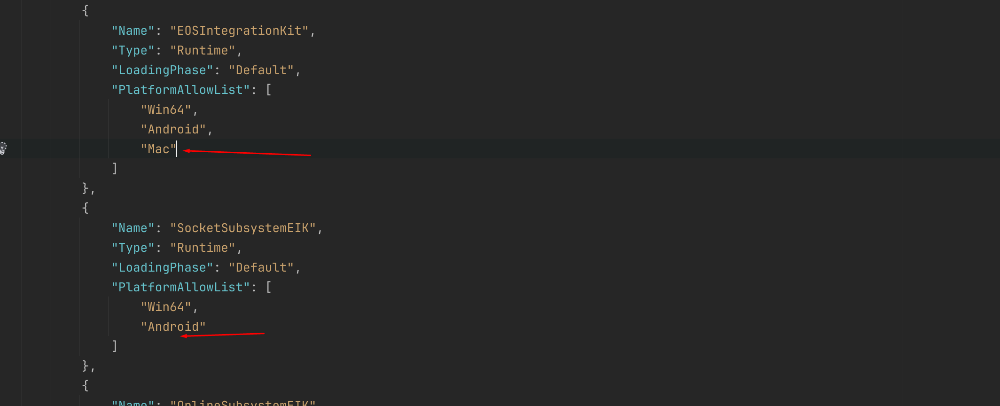

<!-- Add video tutorials back in once they are done -->
<!-- [!badge variant="danger" target="blank" size="xl" icon="video" text="Video Tutorial"](https://youtu.be/tCuE6YOg_-I?si=saGI9DT7IiF_DwjO) -->

Let's get started with installing EOS Integration Kit into your projects, which would be the easiest step, hopefully.

!!!danger 📢 Important Precaution
To ensure seamless integration with the EOS Integration Kit, it is recommended to deactivate the default EOS plugins bundled with the Unreal Engine to avoid any potential conflicts.
!!!  

### Marketplace Edition
[!button variant="primary" icon="download" iconAlign="left" text="Download Marketplace Edition"](https://www.unrealengine.com/marketplace/en-US/product/eos-integration-kit)

So firstly, if you are using the marketplace version, thanks for the purchase 🫡
If you have bought the plugin, go the Epic Launcher and follow the below steps ->
1. Open Library in the Unreal Engine Section of the Epic Launcher

2. Check Valut and install the plugin for the version you want to use

3. Now open or create a project with the same Unreal Engine Version and go to the Plugins section.

4. Enable the Plugin and Restart the Editor

**Done, now you have the plugin ready and are ready to move to the next step 🤝**

### Github Edition
[!button variant="primary" icon="download" iconAlign="left" text="Download GitHub Edition"](https://github.com/betidestudio/EOSIntegrationKit)

Github has two way to get the files, one is the Normal Clone/Download and second is the Release Section. We suggest that you use the Releases version of the plugin for which the link is linked above.
1. Go the GitHub Releases Section and download the latest version for the version you are using.

`SidePoint - Please star the repo lol`

1. Create a C++ Project OR if you have a Blueprint Project already, then just add a empty C++ class and that will do the job.

3. Go to Project Explorer, then create a folder named Plugins and lastly paste the downloaded files in that folder.

4. Right click .uproject file and **Generate Visual Studio Files**

5. Now open the .uproject file and probably, it may ask if you want to rebuild, which you can let it to and done.

!!!danger 📢 This is only for Github Edition

If you are using the Github Edition, then you need to follow the below steps to get the plugin working on Mac, Linux and iOS.

1. Go to the Plugins folder and open the EOSIntegrationKit.uplugin file in a text editor.
2. You will see platform specific sections, where you need to add the Platform name which you want to add support for. For example, if you want to add support for Mac, then you need to add Mac in the WhitelistPlatforms section.
   
   
   
3. Now build the project and you are good to go.

!!!

#### Building From Source Using The Latest Code

While we do our best to ensure that the latest release is available in a pre-built format on GitHub, there may be times we are not able to update the release in a timely manner, or you may want to run the latest codebase outside of an official release. These steps will walk you through how to download the latest code changes and build your plugin from source.

1. Download the latest source files from GitHub

2. Once downloaded, open the file `EOSIntegrationKit-main.zip` and extract it into your Projects `Plugins` directory. Rename the file to `EOSIntegrationKit`

3. Download the Epic Online Services SDK

The EOS SDK can be downloaded from the [Epic Games Dev Portal](https://dev.epicgames.com/portal/en-US/)

Once logged into the Dev Portal, click SDK & Release Notes

Then select the correct SDK Version

!!!info
Current SDK Version: 1.16.2-CL32273396
!!!

4. Copy the SDK into the EOSIntegrationKit Plugin

Open the .zip file and extract the contents of the SDK folder into `YourProject\Plugins\EOSIntegrationKit\Source\ThirdParty\EIKSDK`

Open the `Lib` directory and copy the two .lib files

Paste them into to the `Bin` directory

5. Generate Project Files

Follow step 4 in the [Github Edition](#github-edition) section to regenerate your project files.

6. Build Project

Once you have done all the above steps, it's time to build your project.

Open up the .sln file that was generated in Step 5 and Visual Studio will open. 

At the top, select 'Build' from the menu, and select `Build Solution`

If you have no other issues in your project, the solution should build with no issues or warning.

!!!info
The error list in Visual Studio is notorious for giving false positives. For reliable information make sure to check the `Output Log` in visual studio for any successes or failures. The output log appears as a tab next to 'Error List' in the bottom of the Visual Studio IDE. If you cannot find this window, you can enable it by using `View > Output` 
!!!