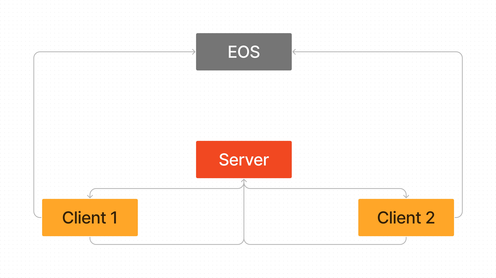

## Basics

EOS Integration Kit has a built-in anti-cheat system that is enabled by default. It is based on the [Easy Anti Cheat](https://www.easy.ac/en-us/) system. It is a server-side anti-cheat system, meaning that it is not possible to cheat on the client-side or that's what the purpose is xD. 

So, let's see how we can use it in our game. 

## How to use it?

So for implementing this, assume that we have two levels in our game. One is the main menu and the other is the game level. All the below steps are to be done in the game level and the respective blueprints have to be used. So for example, `PlayerController` of the game level will be the Controller I am referring to in the following steps.

### 1. Setup Game Mode

First of all, `OnPostLogin` event of the `GameMode` has to be overridden. In this event, we have to call the `Register Client For Anti-Cheat` blueprint node from Anti-Cheat Server and pass the `PlayerController` as the parameter along with Client Product ID. This will register the player with the anti-cheat system. 

[!embed](https://blueprintue.com/render/111z3ihv/)

!!!info
For your information, `EOS_AntiCheatServer_RegisterClient` is the C++ function that is called by the blueprint node.
!!!

### 2. Setup Player Controller

There are basically three things that have to be done in the `PlayerController` blueprint. Let's see them one by one.

- Setup Event BeginPlay to call `RegisterAntiCheatClient` from Anti-Cheat Client. This will initialize the anti-cheat system for the player. Make sure this is done locally only. 

- Second sub step would be to register calls from EOS SDK which would inform you to forward some messages to the anti-cheat server. Bind to `OnSendMessageToServer` event and call a new custom event like in the below graph which will forward to the game server. 

- Create a custom event to receive messages from the server and forward them to the anti-cheat client. 

Make it like the functions below->

[!embed](https://blueprintue.com/render/tdmbuwgk/)

### 3. Generate Anti-Cheat Files

Now the code setup is done, we have to generate the anti-cheat files. For this, we have to run the `GenerateAntiCheatFiles` command from the console. This will generate the required files in the `AntiCheat` folder.