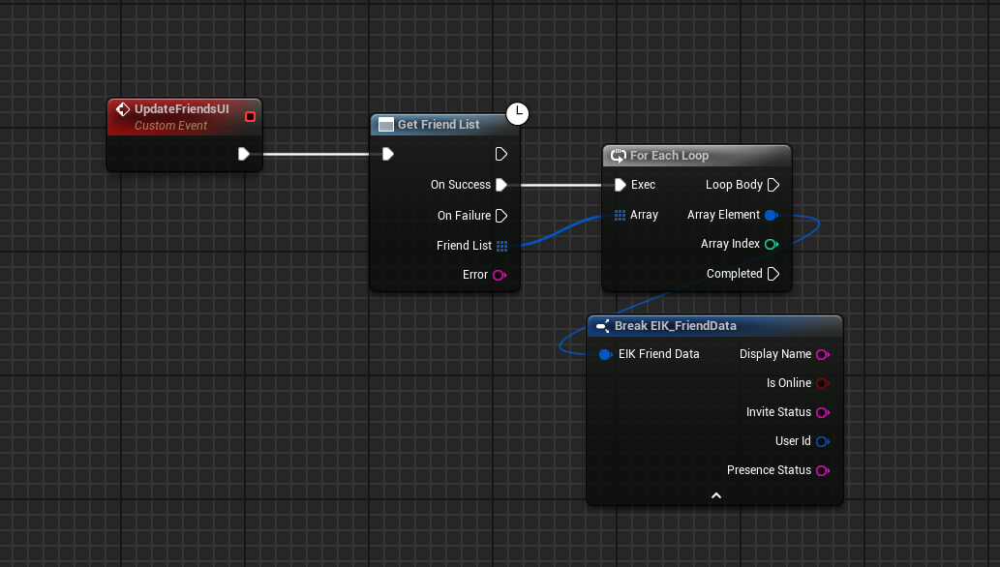
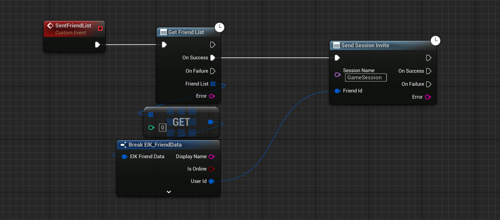
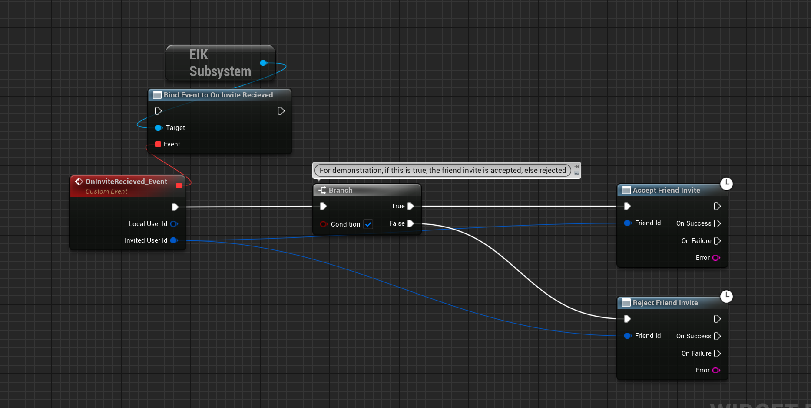
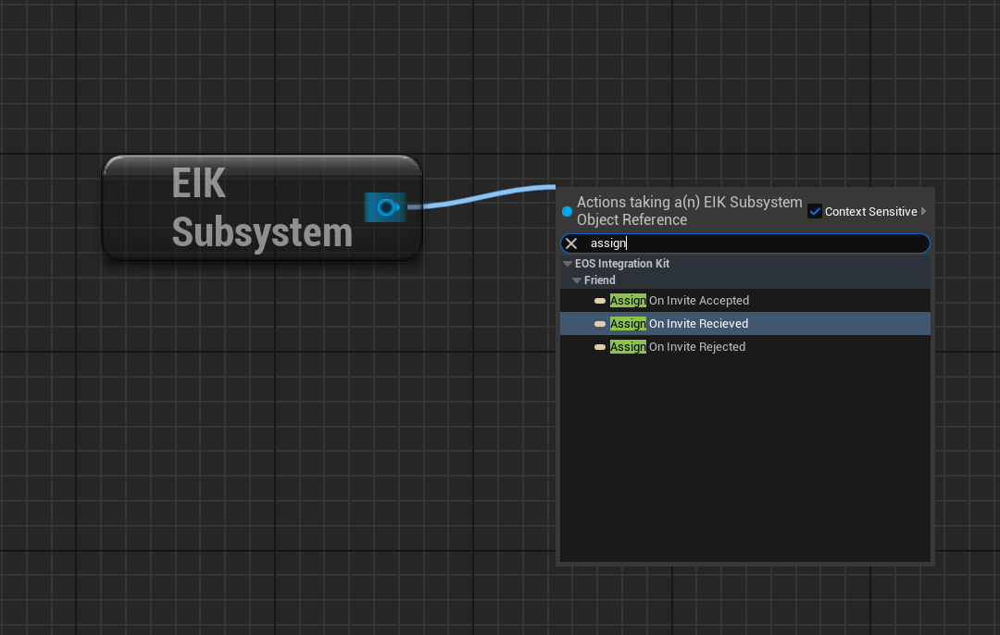

[!badge variant="danger" target="blank" size="xl" icon="video" text="Video Tutorial"](https://retype.com/)

There are two type of friend systems that can be implemented using EOS. Let us see what are those -> 

==- 1. Epic Friend System

This is the friend system that comes with EOS SDK, where all the friends you see are Epic Friends. This means that people can only use the friend feature if they login using EOS like AccountPortal, Persistent Auth etc OR they login using Steam and have connected/linked their steam account to Epic.
===

==- 2. Custom Cross Platform Friend System [!badge variant="warning" text="Upcoming Feature"]

Cross Platform Friend System is a custom friend system that is implemented by the developer. This means that the developer can implement their own friend system and use EOS to send friend requests and other friend related features. This is a very useful feature for games that are cross platform and want to have a friend system that is not dependent on Epic Friends.

===

---

## Epic Friend System

!!!warning
This is the only feature that still uses the old EIK Subsystem. This will be updated in the future to use the new Async System Nodes.
!!!

Setting up Epic Friend System is easy, just initialize EIK and it would be ready to use.

[!embed](https://blueprintue.com/render/7rkf-di2/)

### Show Friend Overlay

[!embed](https://blueprintue.com/render/kvtyvn6l/)

## Extra Functions for EAS Friends

!!!warning Very Important Note
According to [Epic Online Services documentation](https://dev.epicgames.com/docs/epic-account-services/eos-friends-interface#retrieving-and-caching-the-friends-list), please note that functions will only return friends who have played the game at least once and have given their consent. Consent is either give upon game purchase or when a player signs in to an application using Epic Account Services (EAS) and allows EAS access to their account data.
!!!

### Get Friends List

This function will return the list of friends that are playing the game. This function will only return friends who have played the game at least once and have given their consent.

### Send Session Invite to Friend

This function will send a session invite to a friend. As now you can see that the friend system is based on Epic Friends, so the friend you are sending the invite to should be an Epic Friend.

In the example below, we are sending a session invite to a friend who is the first in the array of friends. But  ofcourse, in a idea case, you will send it to the friend that the player selects. The UserID of the friend is required to send the invite and is available in the [GetFriendsList](https://eik.betide.studio/multiplayer/friend-system/#get-friends-list) function. 

### Accept/Reject Session Invite

This function will accept or reject the session invite that the player has received. The invite can be accepted or rejected by the player.

*Please note* that in the below example, the branch is used just as a demo. You can use this function in the callback of the invite received.

### Callbacks

There are three callbacks that are available for the friend system.

1. **Invite Recieved** : This callback is called when the player receives an invite from a friend. The invite can be accepted or rejected by the player.
2. **Invite Accepted** : This callback is called when the player accepts the invite.
3. **Invite Rejected** : This callback is called when the player rejects the invite.

These callbacks are very useful to show the player that they have received an invite and they can accept or reject it.

