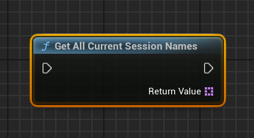
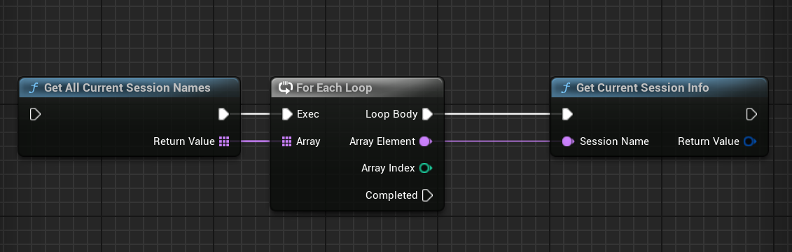
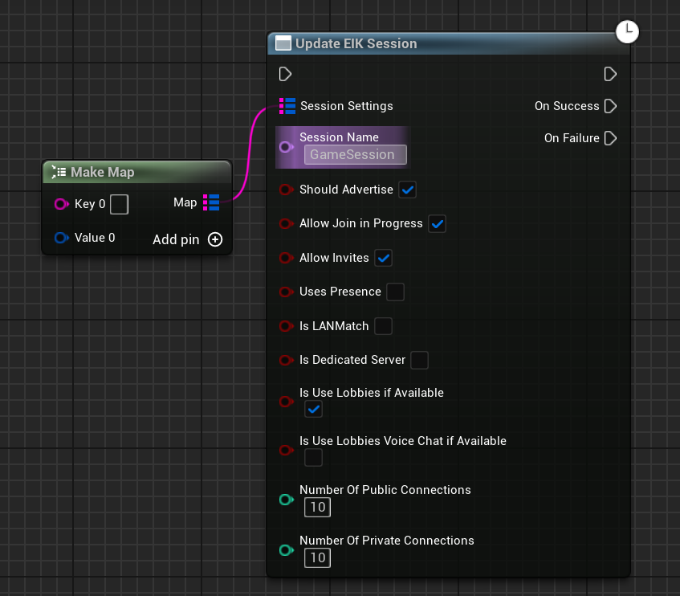
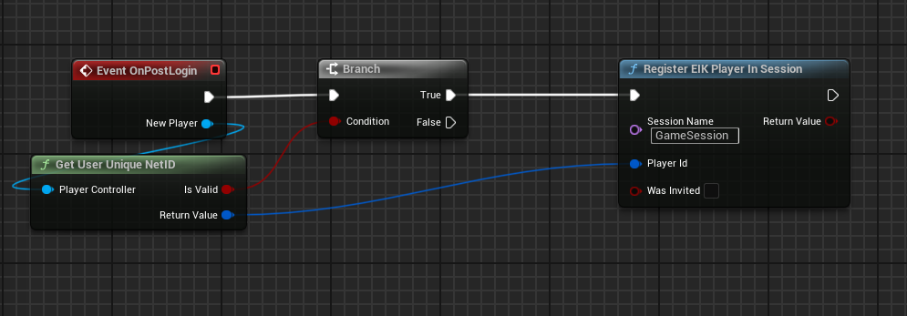
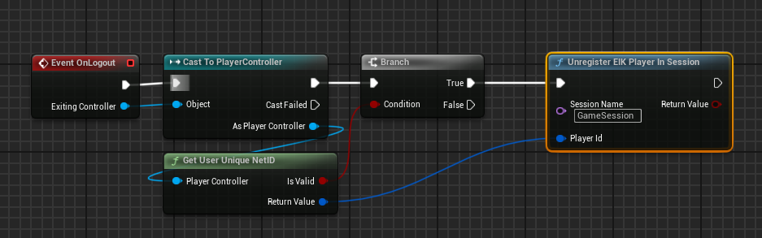

Sessions are pretty easy to setup with EOS Integration Kit. The basic functions like Creating/Finding/Joining are different for the two types of sessions: Peer-to-Peer and Client-Server, so you can check the subpages for more information. 

But there are many more functions that you can use to manage your sessions. Here is a list of all the functions that you can use to manage your sessions:

### Getting the joined session names

As you may have multiple sessions joined at the same time, you can get the list of all the sessions you have joined. This is useful when you want to leave a specific session or when you want to get the session details.

### Getting the session details

Now when you have all the session names, you can get the details of the session. The details include the session name, the session id, the session owner, the session state, the session connection status, the session connection state, the session settings etc. 

### Update the session settings

You can update the session settings like the session state, the session connection status, any extra settings etc.

!!!warning
The session settings can only be updated by the session owner and make sure that if you are trying to update the Lobbies Section, the IsUseLobbiesIfAvailable should be set to true or else the session settings will not be updated.
!!!

### Registering joined players

!!!info
This function is only required when you are using the Matchmaking Sessions as the players are automatically registered when you are using Lobbies Sessions.
!!!

If you are using the Matchmaking Sessions model, you can register the players who have joined the session. This is useful when you want to keep track of the players who have joined the session.

It has to be usually done on the server side and can be done on the PostLogin call of the game mode.

### Unregistering joined players

!!!info
This function is only required when you are using the Matchmaking Sessions as the players are automatically unregistered when you are using Lobbies Sessions.
!!!

If you are using the Matchmaking Sessions model, you can unregister the players who have joined the session. This is useful when you want to keep track of the players who have left the session.

It has to be usually done on the server side and can be done on the Logout call of the game mode.

