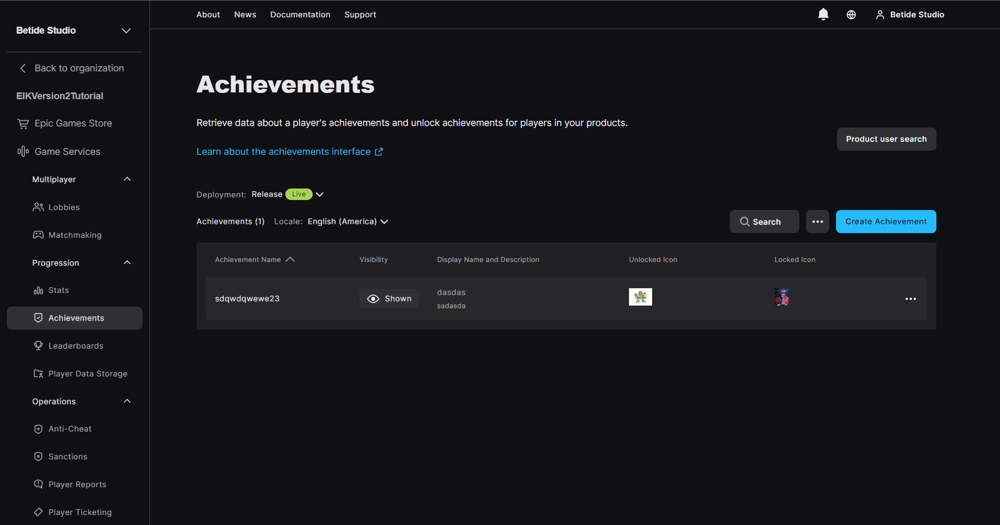
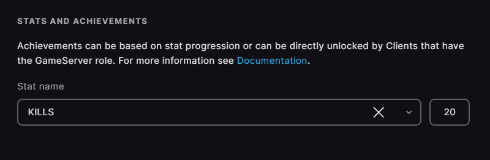
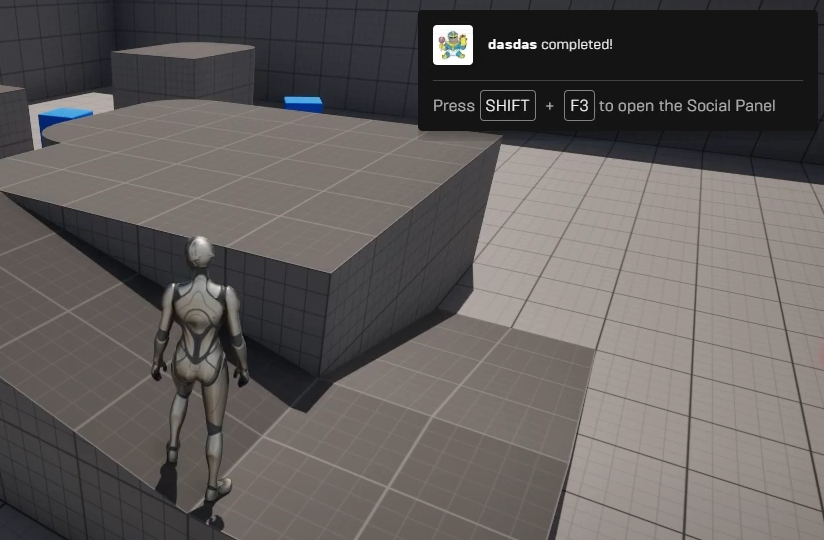

<!-- Add video tutorials back in once they are done -->
<!-- [!badge variant="danger" target="blank" size="xl" icon="video" text="Video Tutorial"](https://youtu.be/tCuE6YOg_-I?si=saGI9DT7IiF_DwjO) -->

!!!info
You need a Stat Created before you can create an Achievement. Check out [Stats](/other-functions/statistics/) for more info.
!!!

### Create Achievements

Go to Achievements under Progression in Game Services and then press on Create Achievement

Now you will notice a Step 1/2, where it will ask you to attach a stat to the achievement. You can select the stat you created from the dropdown and put the amount for the achievement to be unlocked.

Like, in the below image, see we have attached a KILLS stat and the achievement will be unlocked when the player kills 20 enemies.

Now press Next, you will see a Step 2/2, where you can add the achievement name, description, icon and other stuff. All these values will depend upon your usecase.

Achievement ID is also a variable which you can set anything, but it should be unique for each achievement.

### Get Achievement Progress

You can get the progress of the achievement by using the below function. It will return the progress of the achievement in percentage.

[!embed](https://blueprintue.com/render/j41jh6iw/)

### Get More Information about Achievement

You can get more information about the achievement by using the below function. It will return the information about the achievement in a struct.

[!embed](https://blueprintue.com/render/ytnwrl8o/)

### Unlock Achievement

There is nothing special about unlocking an achievement, you just need to make sure the player reaches the level of stat you have set for the achievement. For example, if you have set the achievement to unlock when the player reaches 20 kills, then you just need to make sure that the player reaches 20 kills and the achievement will be unlocked automatically.

