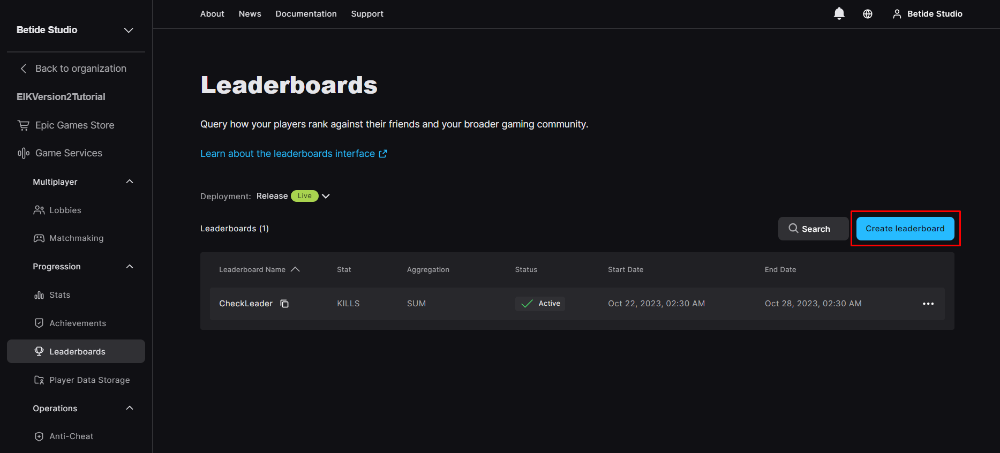

[!badge variant="danger" target="blank" size="xl" icon="video" text="Video Tutorial"](https://youtu.be/tCuE6YOg_-I?si=saGI9DT7IiF_DwjO)

### Create Leaderboard

Go to Leaderboards under Progression in Game Services and then press on Create Leaderboard

You just need to put the Leaderboard Name, and connect a stat to the leaderboard. Now if you want a time-based leaderboard, then you can select End Time or else, just tick `Never Expire this leaderboard`.

### Get Leaderboard

You can get the leaderboard by using the below function. It will return the leaderboard in a struct. You will notice it has a Range and Around Range input fields. Range is the number of entries you want to get from the leaderboard and Around Range is the number of entries you want to get around the player's rank.

So for example, if you want the first 200 entries from the leaderboard, then you can set Range to 100 and Around Range to 100. This will give you the entries from 0 to 200

[!embed](https://blueprintue.com/render/xzinfj9m/)