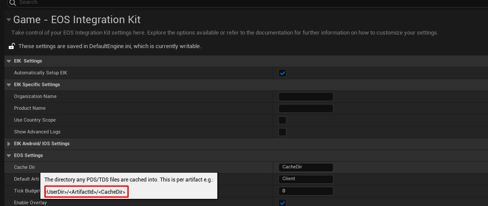

[!badge variant="danger" target="blank" size="xl" icon="video" text="Video Tutorial"](https://youtu.be/tCuE6YOg_-I?si=saGI9DT7IiF_DwjO)

### Create Player Storage

You can upload almost any type of data/files to the Player Storage, if you can get it converted to a byte array. You can use the below function to upload data to the Player Storage. 

[We have two extra function in the plugin which can be used to convert a SAVE GAME object to byte array or a string to byte array and vice-versa]

[!embed](https://blueprintue.com/render/g0u53_ty/)

### Download from Player Storage

You can download almost any type of data/files from the Player Storage, if you can get it converted to a byte array. You can use the below function to download data from the Player Storage.

[We have two extra function in the plugin which can be used to convert a byte array to a SAVE GAME object or a byte array to string and vice-versa]

[!embed](https://blueprintue.com/render/dblp58eb/)

### Cache Directory

All the downloaded files go to the cache directory of the game. You can get the path of the cache directory by checking the EOS Settings under EOS Integration Kit Settings.

