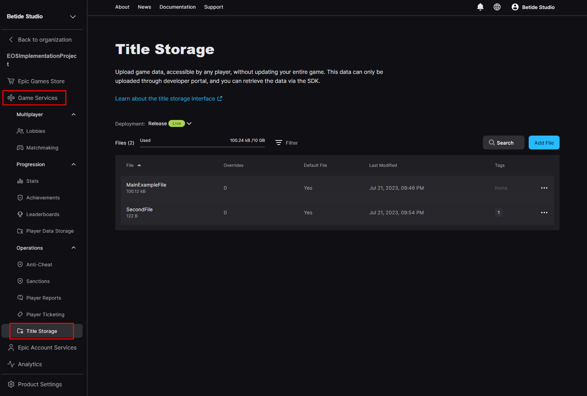
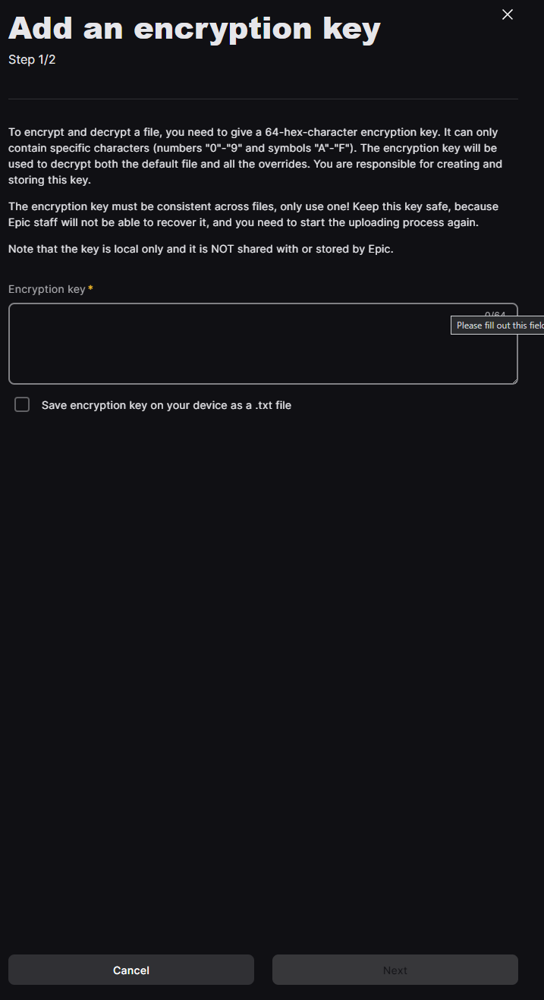
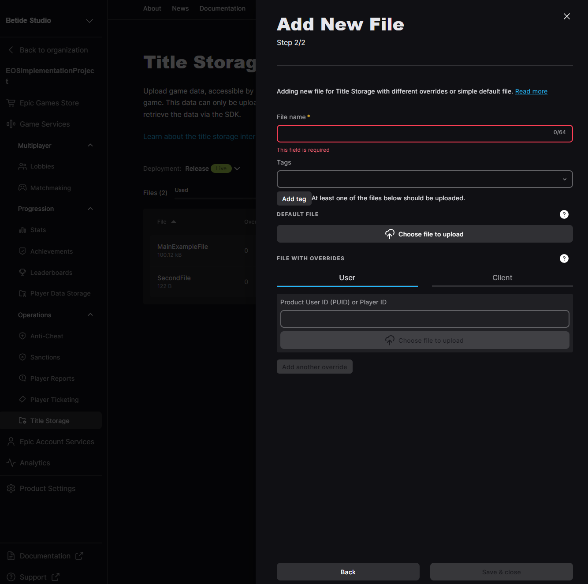

[!badge variant="danger" target="blank" size="xl" icon="video" text="Video Tutorial"](https://youtu.be/tCuE6YOg_-I?si=saGI9DT7IiF_DwjO)

!!!warning
There is no way till the time of writing of docs to upload files and data to Title Storage using any API or from game, so has to be done only through the DevPortal
!!!

### Usecases for Title Storage
- `Patch updating the game` - You can upload patches on title storage as patches are usually less than 100 MBs and then the game, at startup, can verify the current patch tag number with Title Storage's last patch tag number and download the patch and apply it.
- Downloading Exclusive Game Content
- Retrieving Game Configuration and Settings
- Seasonal or Event-based Content Hosting
- Tutorials and Guides

### Upload to Title Storage
Go to Game Services on your product page and then go to Title Storage under Operations.

Now you will see all the already added files here. Now you can press on Add File to add a new one . It will ask for a Encryption Key, which you can use the one from Unreal Engine EIK Settings too. You can also [generate](https://numbergenerator.org/random-64-digit-hex-codes-generator) one and save it as .txt file.

Next, a new pop-up would appear where you have multiple options like File Names, Tags and for overrides and you can enter according to your needs

After you press `Add File`, then you would see in the files list with the tag you added and now you can update the already existing files too.

### Download from Player Storage

The only thing to required files from EOS Title Storage is the File Name and you are good to go

[!embed](https://blueprintue.com/render/2kkkf93y/)

