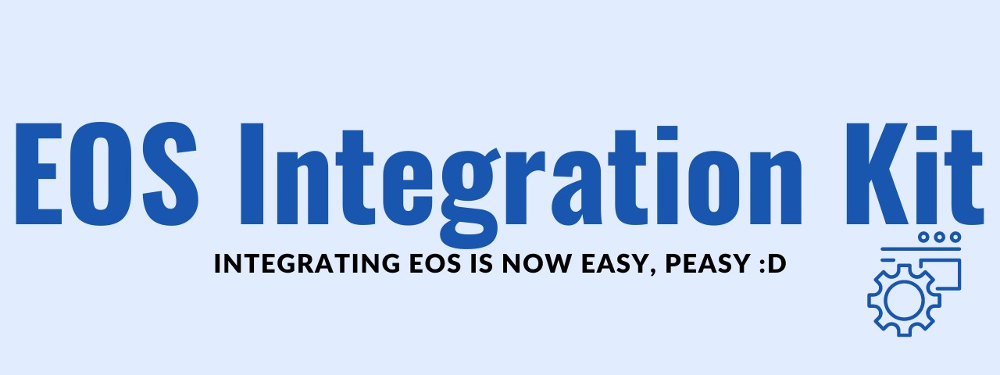

EOS Integration Kit is an easy to use EOS SDK Implementation for Unreal Engine 5. Our main target with this is to help developers across the globe have an easy implementation of EOS and also get the support they need to have it running. 

[!button variant="light" icon=":heart:" text="Marketplace Edition" margin="0 8 0 0"](https://www.unrealengine.com/marketplace/en-US/product/eos-integration-kit)
[!button variant="info" icon=":rocket:" iconAlign="right" text="GitHub Edition"](https://github.com/betidestudio/EOSIntegrationKit)

### Important Information
**Latest Stable Version:** 3.2.0

**Supported Engine Versions:** 5.1, 5.2, 5.3

**Supported Platforms:** Windows, Android, MacOs, Linux, Oculus, iOS

**Last Documentation Update:** 2024-04-13

### Features Comparison

Feature  | **EIK Marketplace**  | EIK GitHub| EOS OSS
---   | ---   | ---    | ---
Pricing | $29.99 | Open-Source | Available with  Unreal Engine
Support | Premium Support | Active Community Support | Eventual support from Epic Staff
Older Versions | Supported | Not Supported | Not Supported
Platforms Supported | Windows, Android, MacOs, Linux, Oculus, iOS | Same as EIK Marketplace | Offical Support for Windows
Update | `Weekly Updates` | Same as EIK Marketplace | Majorly comes with Engine
Voice Support | Most Advanced Voice Integration | Same as EIK Marketplace | Basic Voice Chat
Blueprint Support | Available | Available | -
Login Methods | DeviceID, Steam, Google(Beta), Epic Store, Account Portal, Persistent Auth, DevTool | Same as EIK Marketplace | Epic Methods
Sessions | Dedicated Servers and Listen Servers Supported | Same as EIK Marketplace | Same as EIK Marketplace

